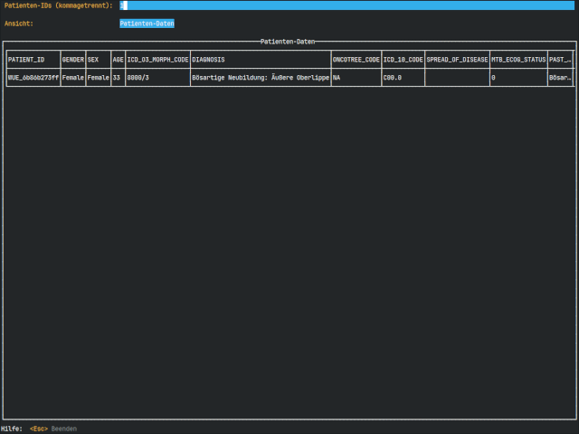

# Onkostar zu cBioportal Bayern

Ziel dieser Anwendung ist der Export relevanter anonymisierter Patientendaten und Daten zu Tumorproben aus Onkostar,
damit diese in eine bayernweite cBioportal Installation importiert werden können.

## Anwendung

Der Parameter `--help` zeigt folgenden Hilfetext an

```
Usage: os2cb <command>

A simple tool to export data from Onkostar into TSV file format for cBioportal

Flags:
  -h, --help                         Show context-sensitive help.
  -U, --user=STRING                  Database username
  -P, --password=STRING              Database password
  -H, --host="localhost"             Database host
      --port=3306                    Database port
  -D, --database="onkostar"          Database name
      --patient-id=PATIENT-ID,...    PatientenIDs der zu exportierenden Patienten. Kommagetrennt bei mehreren IDs
      --id-prefix="WUE"              Zu verwendender Prefix für anonymisierte IDs. 'WUE', wenn nicht anders angegeben.
      --all-tk                       Diagnosen: Erlaube Diagnosen mit allen Tumorkonferenzen, nicht nur Diagnosen mit MTBs
      --no-anon                      Keine ID-Anonymisierung anwenden. Hierbei wird auch das ID-Prefix ignoriert.

Commands:
  export-patients    Export patient data
  export-samples     Export sample data
  preview            Show patient data. Exit Preview-Mode with <CTRL>+'C'
```

Zusätzliche Optionen für die Befehle `export-patients` und `export-samples`

```
      --filename=STRING              Exportiere in diese Datei
      --append                       An bestehende Datei anhängen
      --csv                          Verwende CSV-Format anstelle TSV-Format (UTF-16 und Trennung mit ';' zur Verwendung mit MS Excel)
```

### Hinweis zu Passwörtern

Wird das Passwort nicht als Parameter angegeben, so wird im Anschluss danach gefragt.

### Hinweis zum Export im CSV-Format

Für den Export im CSV-Format wird zur Kompatibilität mit MS Excel der UTF-16 Zeichensatz verwendet. Das Trennzeichen ist dabei `;`.
Es handelt sich daher **nicht** um eine CSV-Datei nach [RFC 4180](https://www.rfc-editor.org/rfc/rfc4180).

### Hinweis zu Diagnosen

Generell verwendet die Anwendung nur Diagnosen, denen ein MTB (Tumorkonferenz mit Typ "27") zugeordnet ist.
Der Standardwert kann - bei Bedarf entsprechend der lokale OS-Installation - auch mit dem Parameter `--mtb-type`
überschrieben werden.
Mit der Option `--all-tk` werden alle Diagnosen berücksichtigt, denen eine beliebige Tumorkonferenz zugeordnet ist.

### Anonymisierung

Die angegebenen IDs der Patienten als auch ermittelten IDs der Proben werden anonymisiert.
Dazu werden aus einer ID ein SHA256-Hash gebildet und von diesem die ersten 10 Zeichen zuzüglich Prefix `WUE_` für den
Export verwendet.

Dies entspricht folgendem Shell-Befehl:

```shell
echo -n "<ID>" | sha256sum | sed -e 's/^\(.\{10\}\).*/WUE_\1/'
```

Der Prefix einer anonymisierten ID kann über den Parameter `--id-prefix` verändert werden. Ohne Angabe wird "WUE" verwendet.

Mit der Option `--no-anon` kann die Anonymisierung deaktiviert werden. **IDs von Patiente und proben werden direkt ausgegeben!**

### Anzeige von Daten innerhalb der Anwendung

Das Anzeigen von zu exportierenden Daten wird durch die beiden Befehle `display-patients` und `display-samples` ermöglicht, ohne in eine Datei speichern zu müssen.
Die Parameter `--filename`, `--apend` und `--csv` werden dabei ignoriert.

Mit der Tabulator-Taste gelangt man zum nächsten Element. Ist die Tabelle ausgewählt, kann mit den Pfeiltasten der anzuzeigende Ausschnitt ausgewählt werden.


